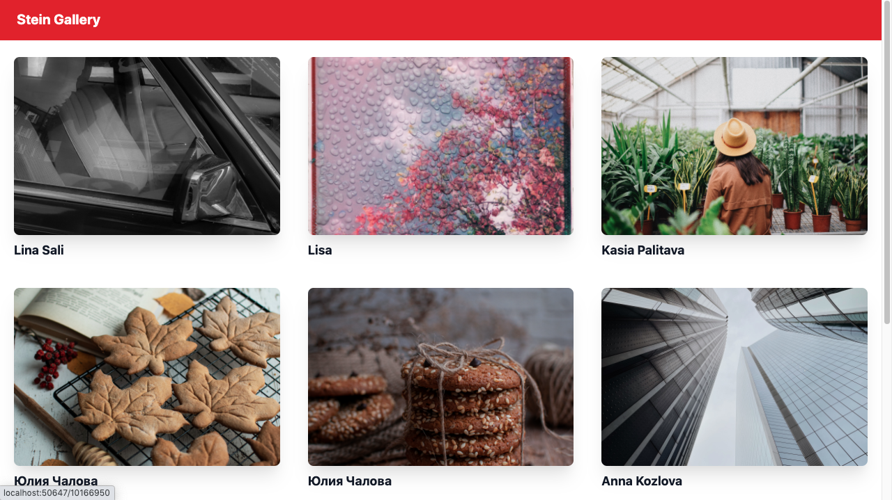

# SteinGallery App

This application use module @nuxtjs/axios to call API at pexels.com and use TailwindCSS to style the UI,and also i add the paginations, you can edit the API KEY and API Address at .env files

## Screen Shoot App
 

